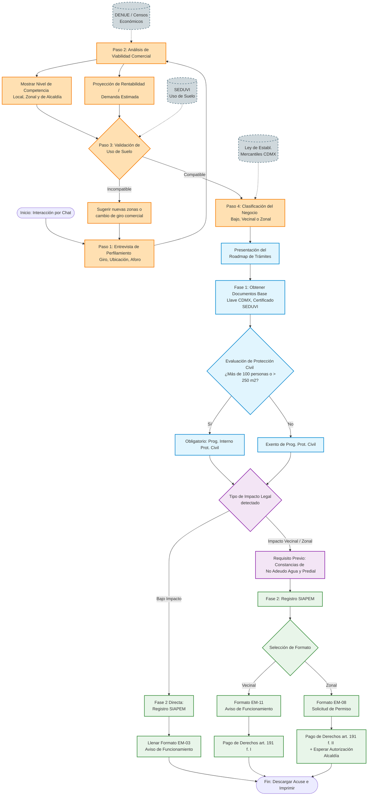

# Esquema de Flujo del Asesor Virtual

El siguiente diagrama modela el journey del usuario a través del asesor virtual. Está construido en lenguaje `mermaid` para facilitar modificaciones futuras.

